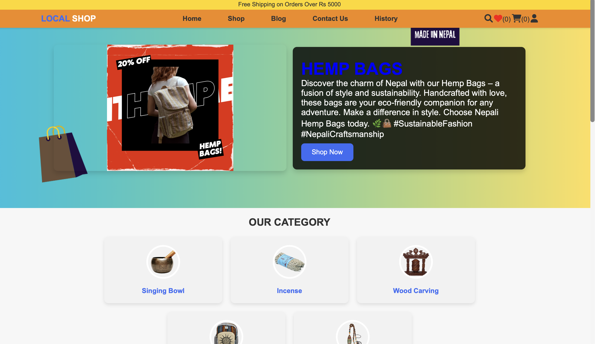
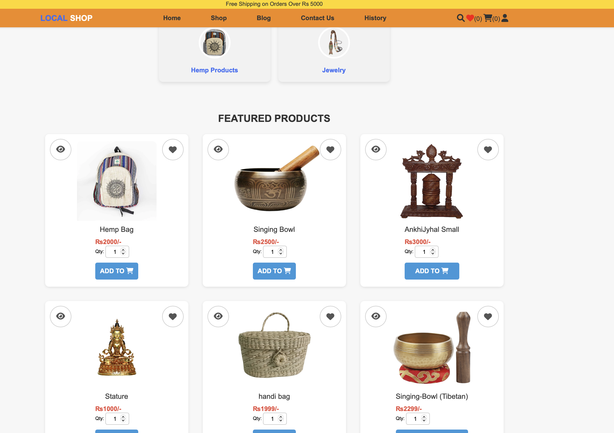
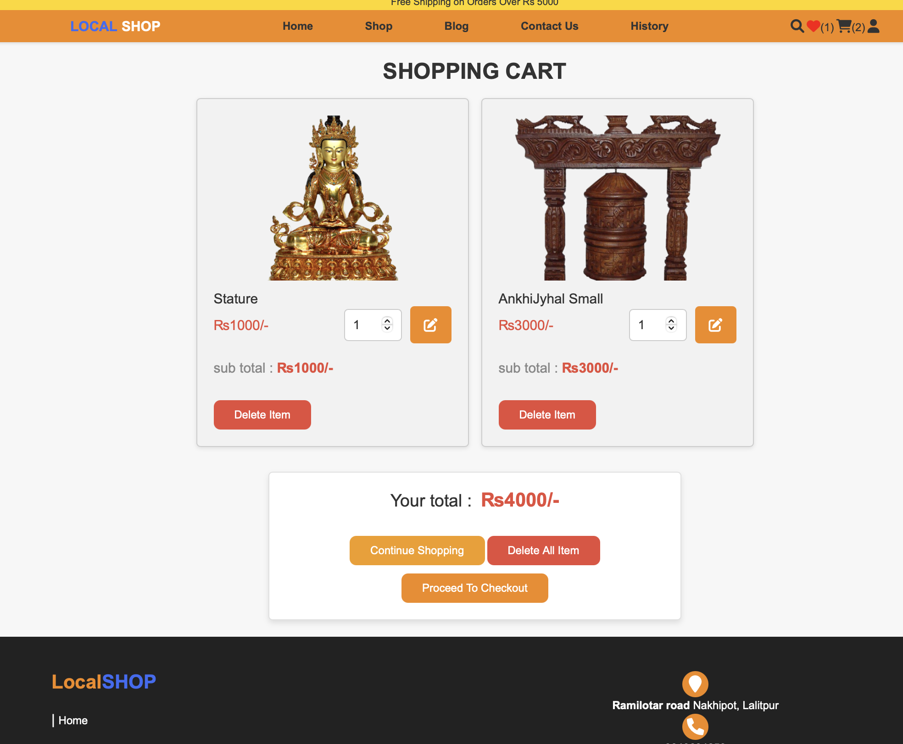
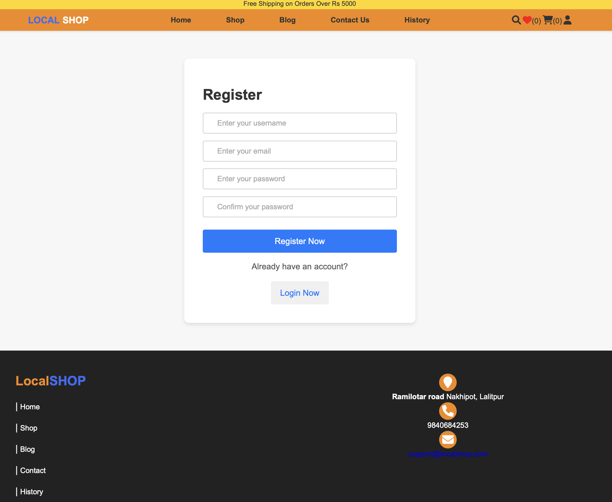
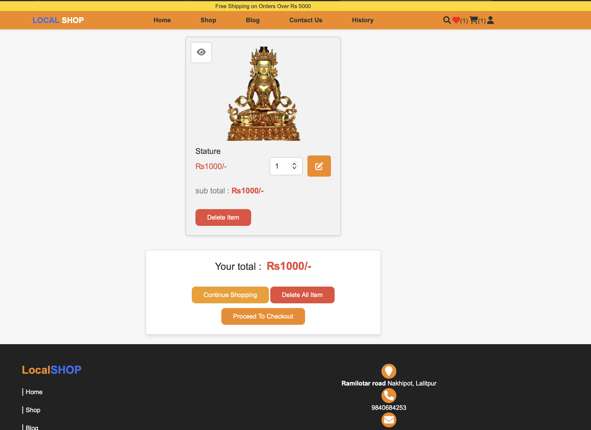
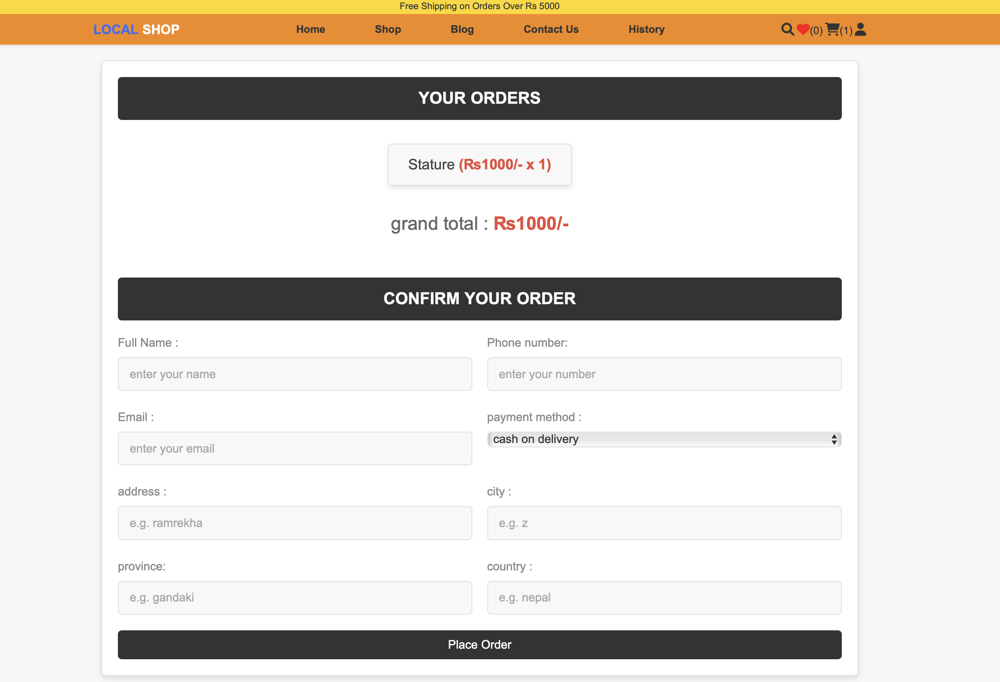
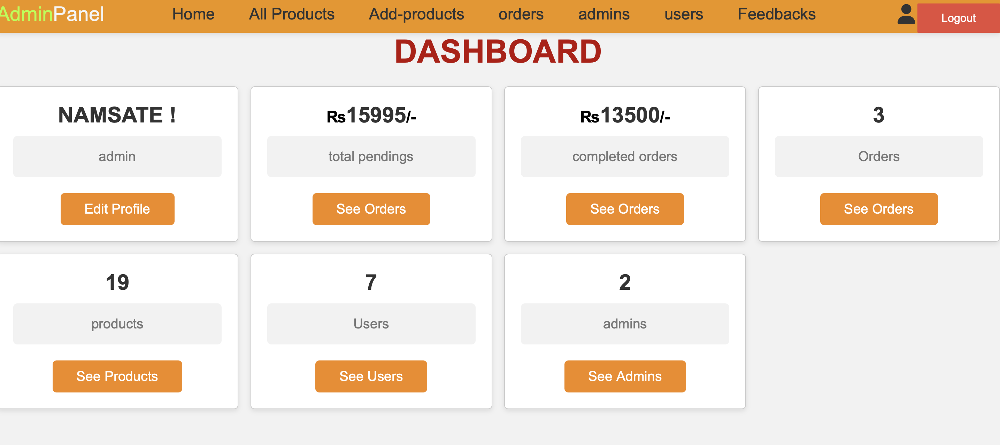
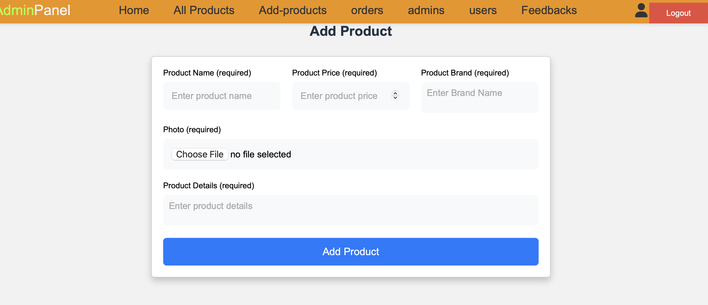
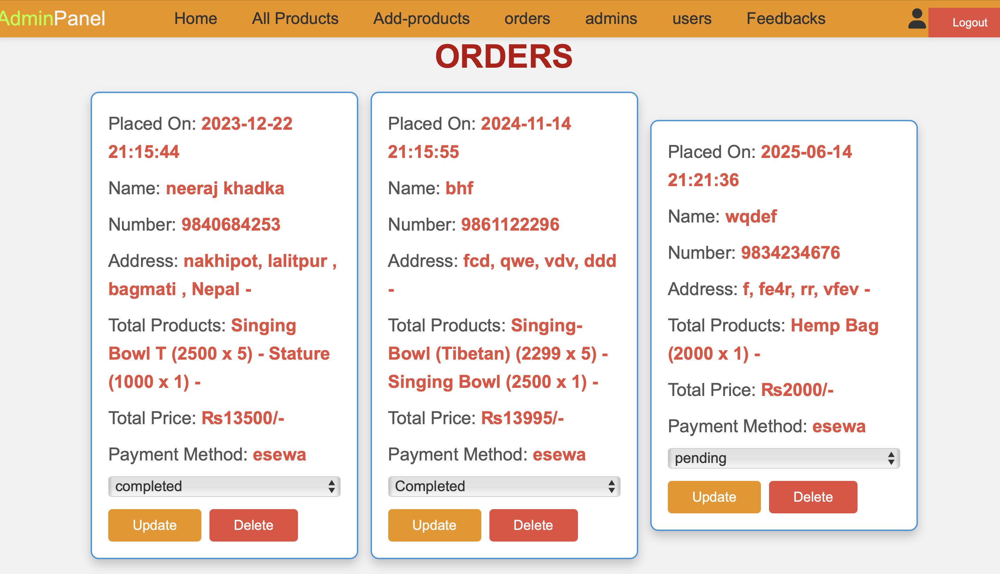

# 🛍️ Online Nepali Handicraft Shop

> **A Digital Marketplace for Authentic Nepali Handicrafts**  
> *4th Semester College Project - Connecting Local Artisans with Global Customers*

[]()
[]()
[]()

---

##  Project Overview

This platform bridges the gap between traditional Nepali handicraft artisans and modern e-commerce, providing a comprehensive online marketplace where authentic handmade products meet digital convenience.

** Core Mission:** Preserve and promote Nepal's rich handicraft heritage through accessible online commerce.

---

## 📸 Project Screenshots

### Customer Interface
<div align="center">

| Home Page | Product Gallery | Shopping Cart |
|:---------:|:---------------:|:-------------:|
|  |  |  |
| *Beautiful landing with featured products* | *Browse authentic handicrafts* | *Easy cart management* |

</div>

### User Experience Flow
<div align="center">

| User Registration | Product Details | Checkout Process |
|:-----------------:|:---------------:|:----------------:|
|  |  |  |
| *Secure account creation* | *Detailed product information* | *Dummy payment options* |

</div>

### Admin Dashboard
<div align="center">

| Admin Analytics | Product Management | Order Management |
|:---------------:|:------------------:|:----------------:|
|  |  |  |
| *Comprehensive business insights* | *Easy product CRUD operations* | *Efficient order processing* |

</div>

---

## ✨ Key Features

### 🛒 **Customer Features**
- **Smart Product Discovery**
  - Advanced search and filtering
  - Category-based browsing
  - Quick product previews
  
- **Personalized Shopping**
  - Wishlist functionality
  - Shopping cart with quantity management
  - User profile customization
  
- **Secure Transactions**
  - Dummy payment option
  - Cash on Delivery option
  - Order tracking system
  
- **User Account Management**
  - Registration and login system
  - Password recovery functionality (Forgot Password)
  - Order history tracking

### 👨‍💼 **Admin Features**
- **Business Analytics Dashboard**
  - Sales performance metrics
  - User engagement statistics
  - Revenue tracking
  
- **Product Management**
  - Add/Edit/Delete products (CRUD)
  - Image upload system
  - Inventory management
  
- **Order Processing**
  - Order status updates
  - Payment verification
  - Customer communication
  
- **User Management**
  - Customer account oversight
  - Admin account management
  - Feedback system

---

## Security Implementation

### **Data Protection**
- **Password Security:** SHA1 hashing for user credentials
- **Input Sanitization:** XSS and SQL injection prevention
- **Session Management:** Secure user session handling
- **Role-Based Access:** Separate admin and user permissions

### **File Security**
- Secure image upload validation
- File type restrictions
- Directory permission management

---

## 🛠️ Technology Stack

<div align="center">

| Frontend | Backend | Database | Security |
|:--------:|:-------:|:--------:|:--------:|
|  |  |  |  |
|  |  | | |
|  | | | |

</div>

### **External Libraries**
- **Swiper.js** - Interactive product image sliders
- **Font Awesome** - Professional iconography
- **Responsive Framework** - Mobile-first design approach

---

## 🚀 Installation Guide

### **Prerequisites**
```bash
- Web Server (XAMPP/WAMP/MAMP)(I used Mamp During Devlopment)
- PHP 7.4 or higher
- MySQL 5.7 or higher
- Modern web browser
```

### **Step-by-Step Setup**

1. **Clone Repository**
   ```bash
   git clone https://github.com/prabinbessie/online-hand-craft-shop.git
   cd online-hand-craft-shop
   ```

2. **Database Configuration**
   ```sql
   CREATE DATABASE handcraft_shop;
   -- Import provided SQL schema
   ```

3. **Database Connection Setup**
   ```php
   // Update components/connect.php
   $db_name = 'mysql:host=localhost;dbname=handcraft_shop';
   $user_name = 'root';
   $user_password = 'your_password';
   ```

4. **File Permissions**
   ```bash
   chmod 755 uploaded_img/
   chmod 755 images/
   ```

5. **Launch Application**
   ```
   http://localhost/online-hand-craft-shop/home.php
   ```

### **Default Admin Credentials**
- **Username:** `admin`
- **Password:** `admin123`
- **⚠️ Change these credentials immediately after first login**

---

##  Project Architecture

```
online-hand-craft-shop/
├── admin/
│   ├── admin_accounts.php
│   ├── admin_login.php
│   ├── addproducts.php
│   ├── dashboard.php
│   ├── messages.php
│   ├── placed_orders.php
│   ├── products.php
│   ├── register_admin.php
│   ├── update_product.php
│   └── update_profile.php
├── components/
│   ├── connect.php
│   ├── admin_header.php
│   ├── user_header.php
│   ├── footer.php
│   ├── like_cart.php
│   └── admin_logout.php
├── css/
│   ├── style.css
│   └── admin_style.css
├── js/
│   ├── admin_script.js
│   ├── script.js
│   └── logic.js
├── images/
├── uploaded_img/
├── cart.php
├── home.php
├── shop.php
├── quick_view.php
├── checkout.php
├── payment.php
├── orders.php
├── like.php
├── contact.php
├── update_user.php
├── search_page.php
└── forgotp.php
```

---

##  Database Schema

### **Core Tables**
- **`users`** - Customer account management
- **`admins`** - Administrative user accounts
- **`products`** - Handicraft product catalog
- **`cart`** - Shopping cart sessions
- **`wishlist`** - Customer favorites
- **`orders`** - Transaction records
- **`messages`** - Customer communications

---

##  User Journey

### **Customer Experience**
1. **Discovery** → Browse featured handicrafts on homepage
2. **Exploration** → Search and filter products by category
3. **Selection** → Add items to cart or wishlist
4. **Registration** → Create account or login
5. **Checkout** → Choose payment method (eSewa/COD)
6. **Tracking** → Monitor order status
7. **Support** → Contact admin for assistance

### **Admin Workflow**
1. **Dashboard** → Monitor sales and user analytics
2. **Inventory** → Add new products with images
3. **Orders** → Process and update order status
4. **Communication** → Respond to customer messages
5. **Management** → Oversee user accounts and system settings

---

## 🌟 Project Highlights

### **Technical Achievements**
- ✅ **Responsive Design** - Optimized for all device sizes
- ✅ **Secure Authentication** - Password hashing and session management
- ✅ **File Upload System** - Image management with validation
- ✅ **Payment Integration** - eSewa API implementation
- ✅ **Search Functionality** - Dynamic product filtering
- ✅ **Admin Analytics** - Business intelligence dashboard

### **Cultural Impact**
- 🎨 **Artisan Support** - Platform for local handicraft sellers
- 🌐 **Digital Preservation** - Online showcase of Nepali craftsmanship
- 🛒 **Accessible Commerce** - Easy-to-use marketplace interface
- 📱 **Modern Experience** - Contemporary shopping for traditional products

---

## 🔮 Future Enhancements

### **Version 2.0 Roadmap**
- 🔐 **Enhanced Security** - Two-factor authentication
- 📧 **Email Integration** - Order notifications and newsletters
- ⭐ **Review System** - Customer product ratings
- 📊 **Advanced Analytics** - Detailed business intelligence
- 📱 **Mobile App** - Native iOS/Android application
- 💳 **Payment Expansion** - Multiple Real payment gateway support

---

## 🎓 Learning Outcomes

This project provided comprehensive experience in:
- **Full-Stack Web Development** - PHP, MySQL, JavaScript integration
- **E-commerce Architecture** - Shopping cart, payment processing, order management
- **Security Implementation** - Input validation, password hashing, session management
- **UI/UX Design** - Responsive layouts, user experience optimization
- **Database Design** - Relational database structure and optimization
- **Project Management** - Version control, documentation, deployment

---

## 🤝 Contributing

While this is a college project, contributions and suggestions are welcome:

1. Fork the repository
2. Create a feature branch (`git checkout -b feature/enhancement`)
3. Commit changes (`git commit -m 'Add new feature'`)
4. Push to branch (`git push origin feature/enhancement`)
5. Open a Pull Request

---

##  Support & Contact

- **Developer:** [Prabin Bhandari]
- **Email:** [em8een@gmail.com]
- **GitHub:** [@prabinbessie](https://github.com/prabinbessie)
- **Project Issues:** [GitHub Issues](https://github.com/prabinbessie/online-hand-craft-shop/issues)

---

## 📄 License

This project is developed as an educational endeavor. Feel free to use, modify, and distribute for learning purposes.

---

<div align="center">

**🇳🇵 Made with ❤️ for Nepal's Rich Handicraft Heritage**

*Supporting Local Artisans Through Digital Innovation*

---

### ⭐ If this project helped you, please give it a star!

[]()
[]()

</div>